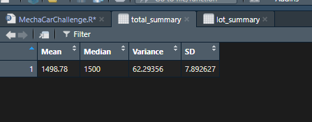
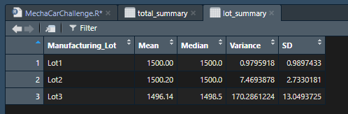
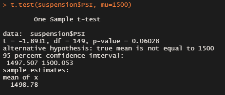
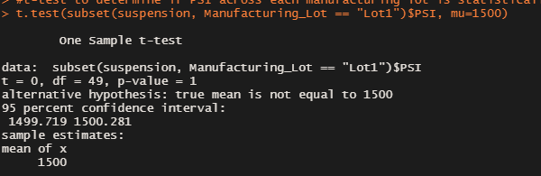
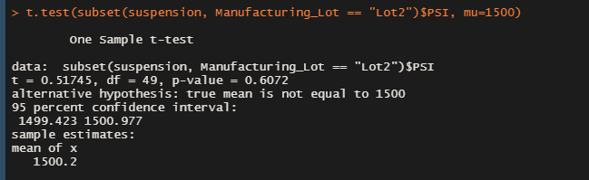
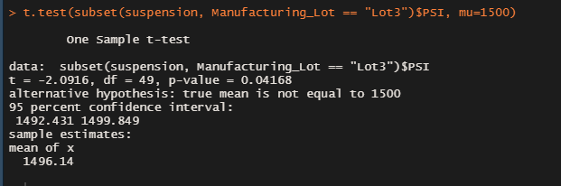

# MechaCar_Statistical_Analysis

## Summary

I am helping my friend Jeremy review the production data for AutosRUs' newest prototype, the MechaCar. It's been having production troubles and AutosRUs' upper management would like the analytics team to review the production data. 

## Linear Regression to Predict MPG

This Multiple Linear Regression model attempted to predict MechaCar fuel efficiency from a number of independent variables. 

The IVs \<vehicle_length\> and \<ground_clearance\>, with low Pr(>|t|) scores of 5.08e-08 and 5.21e-08, respectively, provided a non-random amount of variance to the mpg values in the dataset. 

Our model's p-value is 5.35e-11, which is much smaller than presumed significance level of 0.05%. There is therefore sufficient evidence to reject the null hypothesis, which means that the slope of this model is not zero. 

With an R-squared value of 0.7149, nearly 72% of MechaCar prototypes' mpg variability is explained by this model. I would say in this context, this model's prediction rate is probably effective. Perhaps we'd want it at 75%, 80%, if possible? The more prediction possible, the better, I would assume. I would certainly argue that if we were trying to predict something like a safety rating, we would then want to aim for the highest R-squared value possible with the most non-random variables. 

## Summary Statistics on Suspension Coils

According to MechaCar design specs, the variation for suspension coils must not exceed 100 pounds per square inch. We need to find out if our current manufacturing data meets this design spec for all manufacturing lots in total and for each manufacturing lot individually:

Here we can see that for all of our lots in total, our variance at 62.29 falls well under 100 pounds per square inch. 

However, when we break out into lots, we can see that while Lot 1 is nearly perfect (variance of 0.98), and Lot 2 has some slight variance (7.47), Lot 3's variance is well over 100 pounds per square inch - at 170.27!

The data is showing something needs to be examined with Lot 3's suspension coils.

## T-Tests on Suspension Coils

Here, we are running t-tests on our suspension coils across all of MechaCar's manufacturing lots, and again on each individual lot, to determine if the samples are statistically different from the population mean of 1,500 pounds per square inch. 

*All Lots*

- In my t-test of the sample across all manufacturing lots, my p-value was 0.06028. This value is above the significance level of 0.05, and therefore we do not have sufficient evidence to reject the null hypothesis, meaning that the samples of all the lots are statistically similar to the population mean of 1,500 pounds per square inch. 

*Each Individual Lot*

- Lot 1's p-value of 1 is much greater than the presumed significance level of 0.05. We therefore do not have sufficient evidence to reject the null hypothesis, meaning the sample means of Lot 1 are statistically similar to the population's.

- Lot 2's p-value of 0.6072 is also greater than the presumed significance level of 0.05. Again, we don't have sufficient evidence to reject the null hypothesis, and can say the sample means of Lot 2 are statistically similar to the population's.

- Lot 3's p-value of 0.04168 is less than the presumed significance level of 0.05. Here, we do have sufficient evidence to reject the null hypothesis, and can say there is a statistical difference between the sample means of Lot 3 and those of the population's. 

The results from our t-test again show a statistical difference in Lot 3.

## Study Design: MechaCar vs Competition

One of the bigger drivers for me as a consumer is vehicle safety, so I would create a design comparing MechaCar's safety rating to the competition's. This test can be modified to use any dependent variable so long as its data is a continuous numerical variable, meaning we can investigate MechaCar's performance vs. the Competition on any metric if we have the data.

I would test the the means of the safety ratings from a sample of MechaCar's vehicles and the means of the safety ratings from a sample of MechaCar's Competitor's vehicles in a two-sample t-test. This test could be ran once for each major competitor. 

The null hypothesis of the test is that there's no statistical difference between the two observed sample means - between the safety ratings of MechaCar and those of the Competitor being tested. The alternative hypothesis is that there is a statistical difference between the two observed sample means - that there *is* a statistical difference between the safety ratings of MechaCar and its Competitor. 

The two-sample t-test is designed to determine whether the means of two samples are statistically different. Running this test between MechaCar and each of its competitors on Safety Ratings will tell us if there is a significant, statistical difference in safety ratings between MechaCar and any of the Competitors. If so, further testing and visualization can be run to exampine each difference.

Each time we run this test, we need a reasonably large, randomly-selected, normally-distributed sample dataset from both MechaCar and its Competitor that contains information on the variable we're testing - in this initial case, safety rating. Safety rating - and any variable tested - should be continuous, numeric data. 

Finally, we need to ensure that the two data samples have similar variance. 

